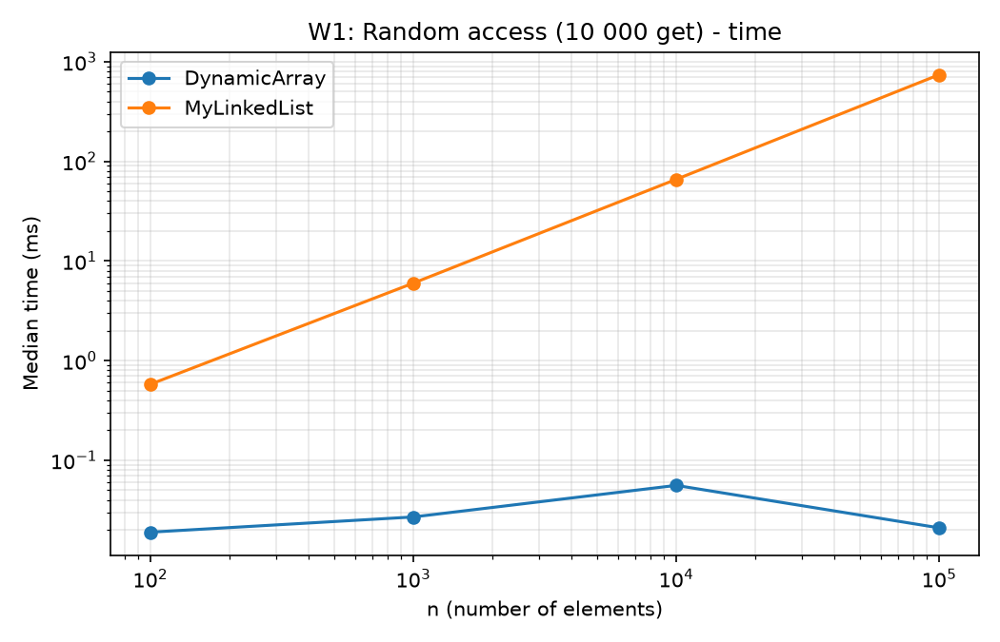
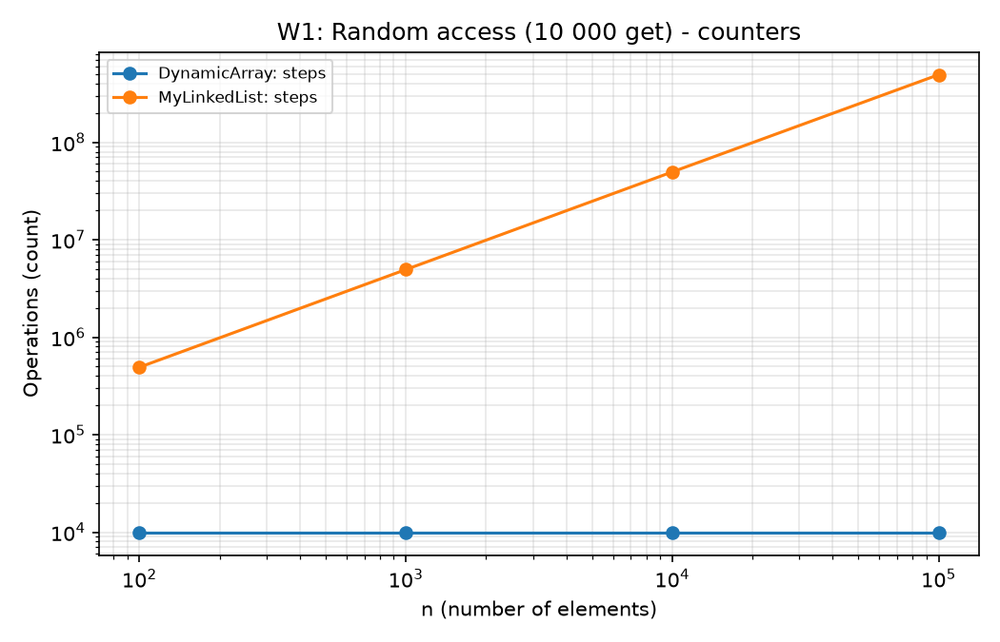
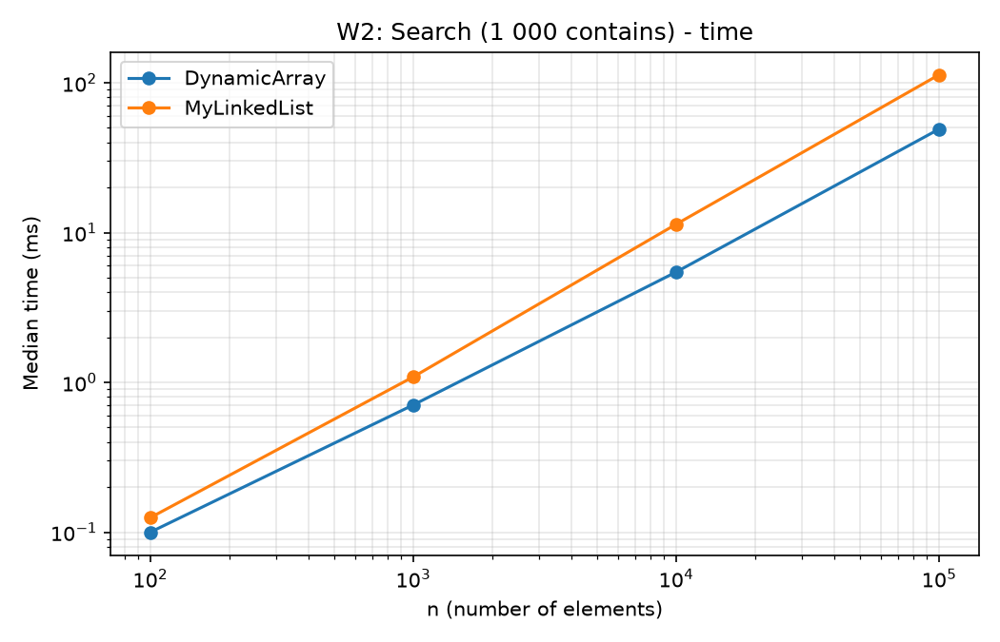
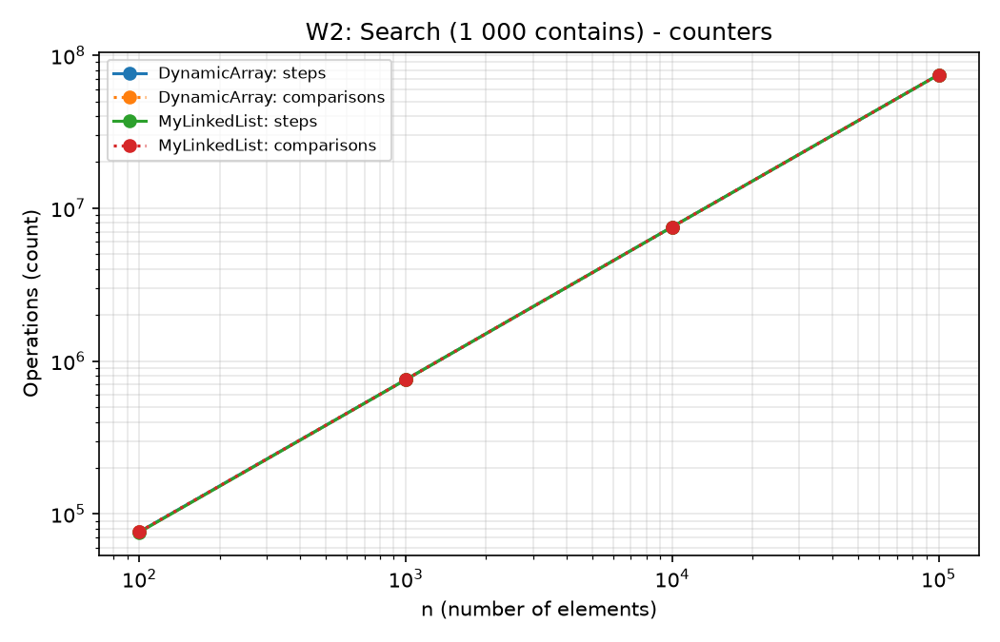
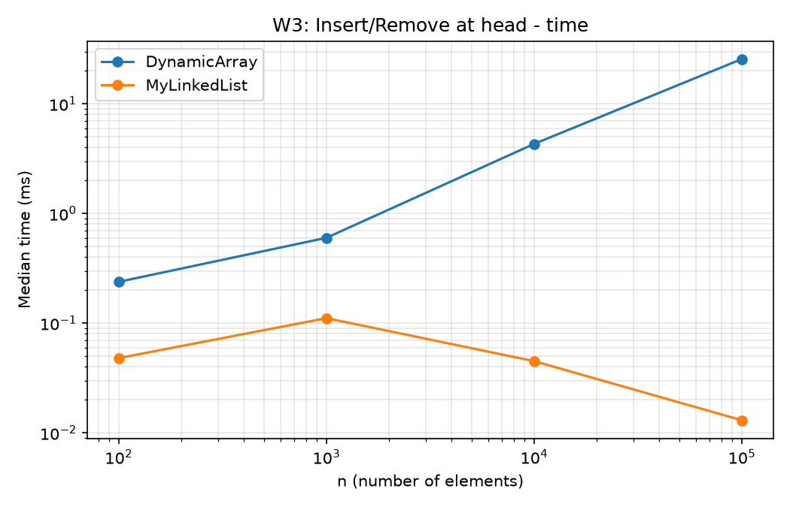
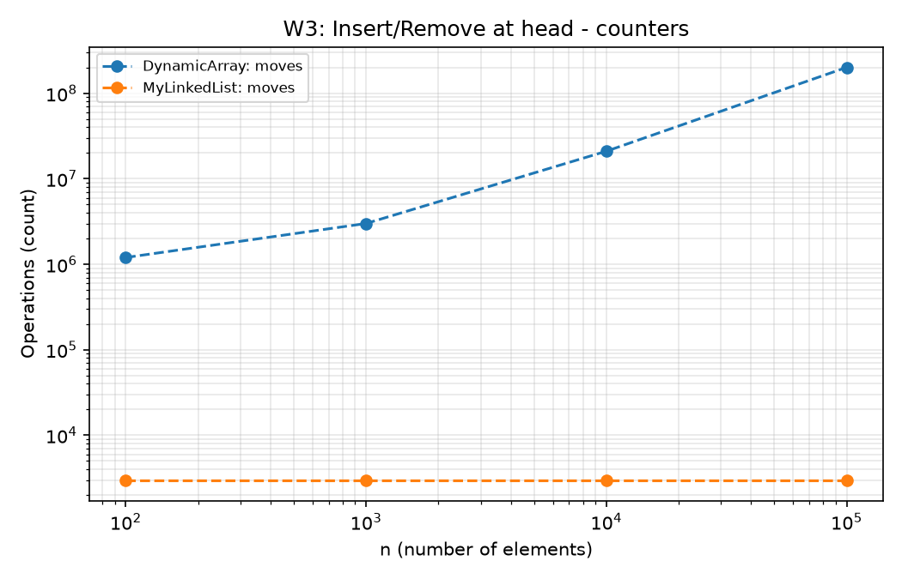
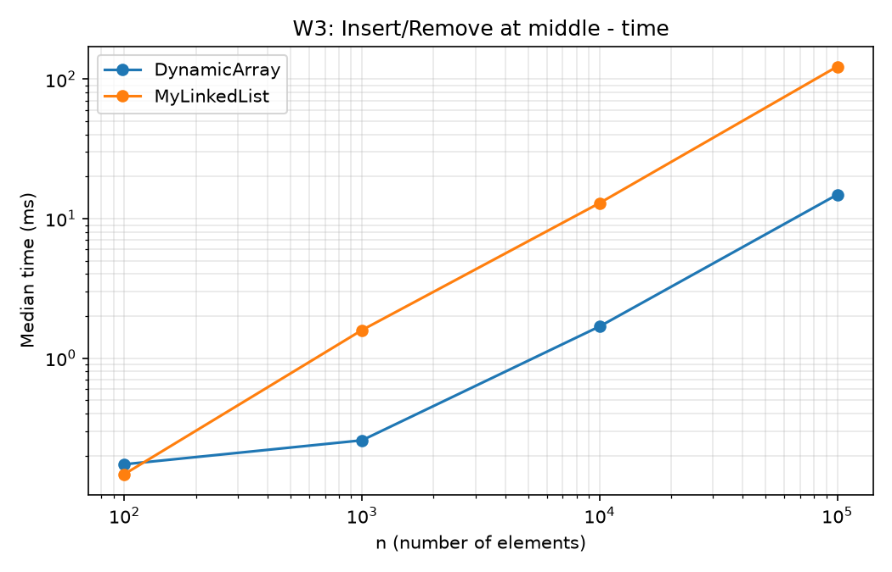
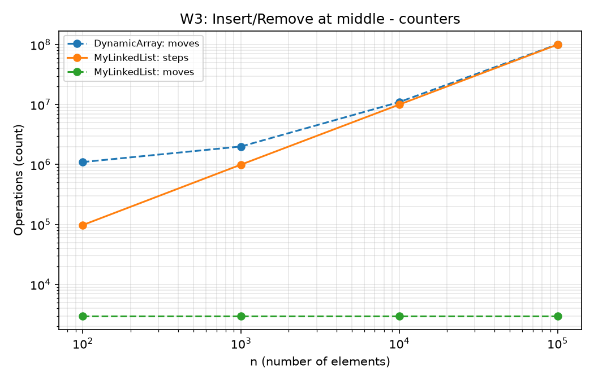
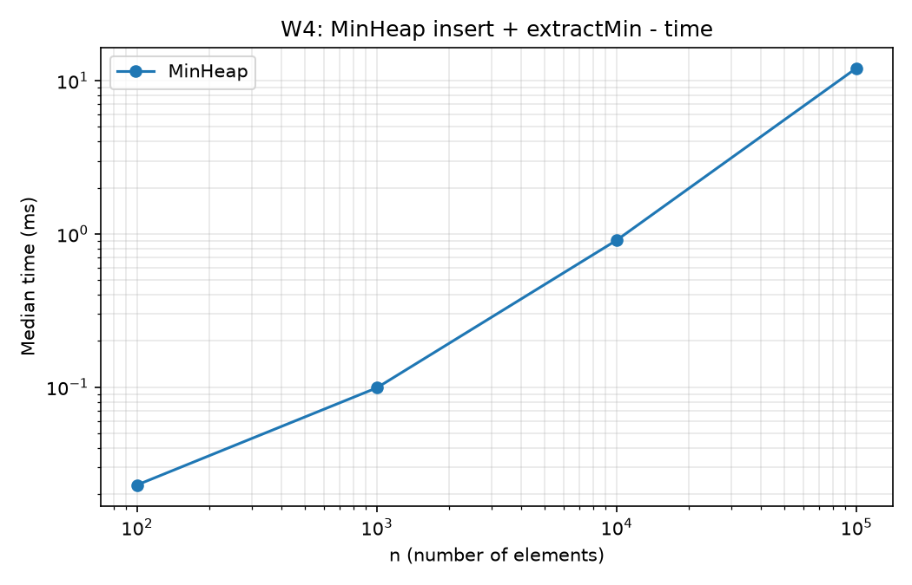
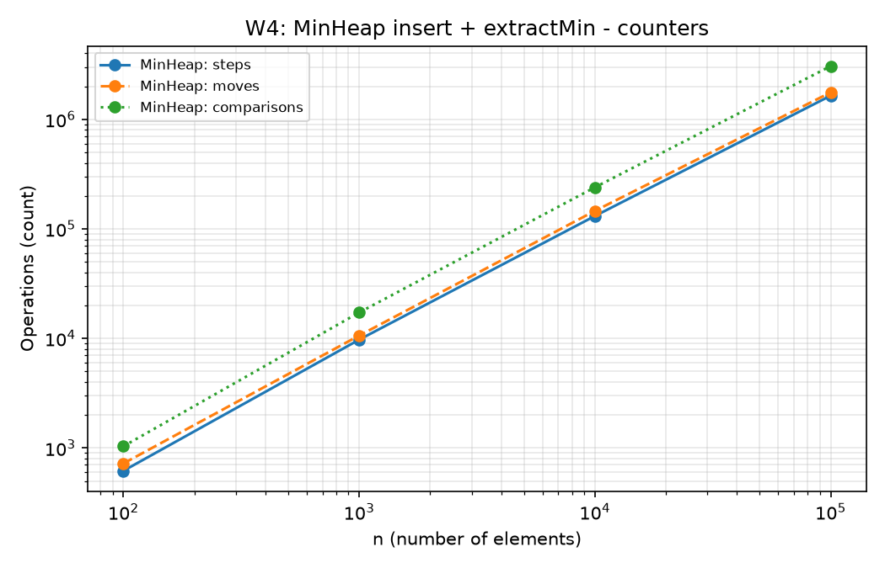

# DAA Assignment 2 - In-Memory Workload Engine

**Student:** Tomiris Zhumagaazy, group SE-2516
**Repository:** https://github.com/tomirisZh/DAA_Assignment2.git (branch `main`, tag `v1.0`)

## 1. Overview

Three structures were implemented from scratch for `int` values: `DynamicArray`
(`int[]`, 2x growth), `MyLinkedList` (singly linked, with head and tail pointers) and
`MinHeap` (array-based binary heap). `DynamicArray` and `MyLinkedList` implement one
interface `IntList`, so one benchmark runs both. Counters are incremented inside the
methods: `steps` is one array-cell read or one move to the next node, `moves` is one
element shift (or copy during growth) or one link update, `comparisons` is one
comparison of two elements.

Benchmark setup: `new Random(42)`, n = 100, 1 000, 10 000, 100 000. Every case runs
10 warm-up runs (discarded) and 5 measured runs, and the median time is saved. Before
measuring, all workloads are run 20 times at n = 1 000 to compile the code with the JIT.
Times below about 0.1 ms are close to timer and scheduler noise.

## 2. Complexity table

n is the current number of elements. "Aux. space" is the extra memory beyond the
structure itself.

| Structure | Operation | Best | Average | Worst | Aux. space | Justification |
|---|---|---|---|---|---|---|
| DynamicArray | `add(x)` | Θ(1) | Θ(1) amortized | Θ(n) | Θ(1), Θ(n) on growth | Worst case: the array is full and n elements are copied; copies sum to < 2n over n adds |
| DynamicArray | `add(i, x)` | Θ(1) | Θ(n) | Θ(n) | Θ(1) | Best: i = size; worst: i = 0 shifts all n elements |
| DynamicArray | `remove(i)` | Θ(1) | Θ(n) | Θ(n) | Θ(1) | Best: last element; otherwise size - i - 1 shifts |
| DynamicArray | `get(i)` | Θ(1) | Θ(1) | Θ(1) | Θ(1) | Direct index access |
| DynamicArray | `contains(x)` | Θ(1) | Θ(n) | Θ(n) | Θ(1) | Best: x is first; worst: x is absent |
| MyLinkedList | `add(x)` | Θ(1) | Θ(1) | Θ(1) | Θ(1) | The tail pointer avoids a walk |
| MyLinkedList | `add(i, x)` | Θ(1) | Θ(n) | Θ(n) | Θ(1) | Best: i = 0 or i = size; otherwise a walk to node i - 1 |
| MyLinkedList | `remove(i)` | Θ(1) | Θ(n) | Θ(n) | Θ(1) | Best: i = 0; otherwise a walk to node i - 1 |
| MyLinkedList | `get(i)` | Θ(1) | Θ(n) | Θ(n) | Θ(1) | Best: i = 0; average about n/2 node moves |
| MyLinkedList | `contains(x)` | Θ(1) | Θ(n) | Θ(n) | Θ(1) | Same as the array, but following references |
| MinHeap | `insert(x)` | Θ(1) | O(log n) | Θ(log n) | Θ(1), Θ(n) on growth | Best: x >= parent; worst: bubble-up to the root, height ⌊log₂ n⌋ |
| MinHeap | `peekMin()` | Θ(1) | Θ(1) | Θ(1) | Θ(1) | Reads `data[0]` |
| MinHeap | `extractMin()` | Θ(1) | Θ(log n) | Θ(log n) | Θ(1) | Best: all values equal, sift-down stops at once; typically the moved element sinks near a leaf |

Total memory of the structures: `DynamicArray` Θ(n) (up to 2n cells), `MyLinkedList`
Θ(n) (n node objects, each with header, value and reference), `MinHeap` Θ(n).

## 3. Loop invariant proofs=

### 3.1 `DynamicArray.contains`

```java
for (int i = 0; i < size; i++) {
    if (data[i] == x) return true;
}
return false;
```

- **Invariant:** before each iteration with index i (0 <= i <= size), the value x does
  not occur in `data[0..i-1]`.
- **Initialization:** for i = 0 the prefix `data[0..-1]` is empty, so x is not in it.
- **Maintenance:** assume the invariant holds before iteration i. If `data[i] == x`, the
  method returns `true` and the loop ends. Otherwise `data[i] != x`, so x is not in
  `data[0..i]`, which is the invariant for i + 1.
- **Termination:** if the loop ends without `return`, then i = size and the invariant says
  x is not in `data[0..size-1]`, i.e. not in the whole array.
- **Conclusion:** `true` is returned only when an element equal to x was seen, and `false`
  only when the invariant proves that none of the `size` elements equals x, so the
  result is correct.

### 3.2 `MinHeap.siftDown` (used by `extractMin`)

```java
while (true) {
    int l = 2*i + 1, r = 2*i + 2;
    if (l >= size) break;
    int smallest = l;
    if (r < size && data[r] < data[l]) smallest = r;
    if (data[i] <= data[smallest]) break;
    swap(i, smallest);
    i = smallest;
}
```

- **Invariant:** before each iteration, the heap property `data[parent(j)] <= data[j]`
  holds for every pair (parent(j), j) except possibly the pairs (i, child of i); and if
  i has a parent, then `data[parent(i)] <=` both children of i.
- **Initialization:** `extractMin` moves the last element to the root (i = 0). The heap was
  valid before, so only the pairs (0, children of 0) can be broken. The root has no
  parent, so the second part holds trivially.
- **Maintenance:** let `smallest` be the smaller child of i. If `data[i] <= data[smallest]`
  the loop ends (see Termination). Otherwise we swap. The old `data[smallest]` now sits
  at i: it is >= `data[parent(i)]` by the second part of the invariant, and it is <= the
  other child because it was the smaller one, so the pairs around i are correct. The
  moved element is now at `smallest`; only its pairs with its own children can be
  broken, and its new parent (the old `data[smallest]`) is <= those children by the
  original heap property. This is the invariant for i := smallest.
- **Termination:** the loop ends when i has no children (no excluded pairs) or when
  `data[i] <= data[smallest]` (the excluded pairs are correct). In both cases no pair is
  an exception, so the heap property holds everywhere. The index at least doubles every
  step, so there are at most ⌊log₂ n⌋ iterations.
- **Conclusion:** `extractMin` returns the old root, which is the minimum, and the remaining
  elements form a valid heap again, so the next `extractMin` is also correct.

## 4. Results

Raw data: `results/results.csv`. Plots are produced by `scripts/plot.py`.

### W1 - Random access (10 000 `get`)



### W2 - Search (1 000 `contains`, half present, half absent)



### W3 - Insert and remove at head



### W3 - Insert and remove at middle



### W4 - MinHeap (n inserts + n `extractMin`)



Key numbers at n = 100 000:

| Workload | DynamicArray | MyLinkedList |
|---|---|---|
| W1 time / steps | 0.021 ms / 10 000 | 739.6 ms / 493 278 268 |
| W2 time / comparisons | 49.1 ms / 74 639 143 | 113.2 ms / 74 639 143 |
| W3 head time / moves | 25.6 ms / 200 999 000 | 0.013 ms / 3 000 |
| W3 middle time / moves + steps | 14.9 ms / 100 999 000 moves | 123.2 ms / 99 998 000 steps + 3 000 moves |

W4 (MinHeap): 12.1 ms, 3 059 125 comparisons, 1 759 236 moves. The output of all
`extractMin` calls was checked to be non-decreasing.

## 5. Discussion

At n = 100,000, 10,000 get() calls take 0.021 ms in DynamicArray and 739.6 ms in
MyLinkedList (W1). The counters explain the gap: the array makes one step per get
(10,000 in total), while the list makes 493 million steps, because get(i) walks i nodes
and the average i is n/2. In W2 both structures do the same work (about 74.6 million
comparisons), yet the list needs 113.2 ms and the array 49.1 ms, 2.3 times more. The
same effect appears in W3 (middle): the array makes 101.0 million moves and the list
100.0 million steps, both Θ(n), but the array finishes in 14.9 ms and the list in
123.2 ms (8.3 times slower). The reason is memory layout. Array elements lie next to
each other, so one 64-byte cache line holds 16 ints and the hardware prefetcher
predicts the sequential access. In the list every step needs the address stored in the
previous node, so the loads depend on each other (pointer chasing) and cannot overlap,
and each node is a separate object with an object header, an int and a reference
(about 24 bytes instead of 4), so fewer elements fit into a cache line. Separate node
objects also load the allocator and the garbage collector; we did not measure this
directly (JOL would show it). The list cost per step grew only from 1.2 ns (n = 100) to
1.5 ns (n = 100,000), probably because nodes were allocated one after another and lie
close in memory; with fragmented nodes the gap would be larger. The list wins when we
insert or remove at the head: in W3 (head) at n = 100,000 it needs 3,000 pointer updates
and 0.013 ms, while the array makes 201 million moves and needs 25.6 ms. This
advantage exists only when the position is already known (head, tail or a saved node);
for the middle the list must first walk to it, and the array is faster. MinHeap is the
right choice when we repeatedly need the smallest element: peekMin is O(1) and
extractMin is O(log n), while an array would need a Θ(n) scan each time. In W4 at
n = 100,000 the heap used 3.06 million comparisons, about 1.84 · n · log₂ n, which
matches the Θ(n log n) bound for n inserts plus n extractMin calls. Overall, equal
Big-O does not mean equal running time: constant factors from cache behaviour and
memory layout can change the result several times, so measurement is necessary.

## 6. Testing

JUnit 5 tests (`mvn test`): a shared contract for `DynamicArray` and `MyLinkedList`
(empty structure, one element, duplicates, first/last index, invalid index, growth,
5 000 random operations compared with `java.util.ArrayList`, counters not zero in
head insert); for `MinHeap` the heap property after every insert and extractMin, sorted
output compared with `java.util.PriorityQueue`, exceptions on an empty heap.
`java.util` is used in tests only.

## 7. How to reproduce

```
mvn test
mvn -q compile
java -cp target/classes workload.Benchmark
python scripts/plot.py
```